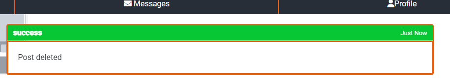
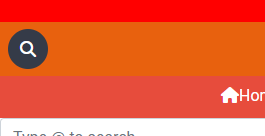
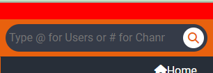

# Code Institute Chat Hub - Group Chat App
 

## Table of contents
- [Code Institute Chat Hub - Group Chat App](#code-institute-chat-hub---group-chat-app)
  - [Table of contents](#table-of-contents)
  - [Overview](#overview)
  - [UX](#ux)
    - [Strategy](#strategy)
    - [Scope](#scope)
    - [Structure](#structure)
    - [Skeleton](#skeleton)
    - [Surface](#surface)
      - [Color Scheme](#color-scheme)
      - [Fonts](#fonts)
      - [Visual Effects](#visual-effects)
  - [Agile Methodology](#agile-methodology)

## Overview
The Code Institute Chat Hub is a Django-based web application designed for a coding course community. The home page features group chat functionality, allowing users to participate in discussions related to the Code Institute coding course. Users can create and join different chat channels, engaging in real-time conversations with fellow learners. The Direct Message section enables one-on-one communication, allowing users to connect and share information privately. Additionally, each user has a Profile Page for managing account settings, viewing activity, and accessing joined chat channels. The application prioritizes real-time updates, supports multimedia content, and incorporates authentication and authorization features for secure user interactions. The Code Institute Chat Hub aims to foster collaborative learning and communication within the coding community, offering a platform akin to popular communication tools like Slack.
  
The fully deployed project can be accessed here [Code Institute Chat Hub](https://ci-chathub-f163e2297a1b.herokuapp.com/).
  

## UX
This site was created respecting the Five Planes Of Website Design: 
### Strategy

**User Stories and Epics:**  
User stories and epics can be viewed here on the project [kanban board ](https://github.com/users/jamie33o/projects/14?pane=issue&itemId=45978557)

**Project Goal:** 
Create a website similar to Slack but specifically tailored for Code Institute.

**Project Objectives:**  
* Develop a real-time messaging platform to facilitate seamless communication among Code Institute community members.
* Implement a user-friendly interface with channels dedicated to various Code Institute topics, fostering organized discussions.
* Enhance user engagement with multimedia support in direct messages and emoji reactions for interactive conversations.
* Establish secure user authentication, authorization, and profile management features to ensure a personalized and protected user experience.
  

### Scope

**User Management**
   - User registration and authentication.
   - User roles and permissions for various levels of access.
   - Profile creation and management.

**Communication Features**
   - Real-time messaging functionality for group discussions in channels.
   - Direct messaging for private one-on-one conversations.
   - Multimedia support, including file attachments and emoji reactions.

**Channel Management**
   - Creation, joining, and leaving of channels.
   - Categorization of channels based on Code Institute topics or modules.
   - Ability to search and discover relevant channels.

**User Interface and Experience**
   - Intuitive and user-friendly interface for seamless navigation.
   - Responsive design for accessibility on various devices.
   - Personalization options for user profiles.

**Responsiveness** 
* Create a responsive design for desktop, tablet and mobile devices.  

### Structure

The structure of the website is divided into seven pages but with content depending on authentication and client/staff status  

- **Register/Login/logout/email settings/password change** for this the Django app Allauth was used, the pages give the user the possibility to create an account, login or log out, add or remove emails and change there password. 

- The **Home** page consists of 3 sections channels/unread messages list, posts and comments.Posts and comments are loaded using ajax depending on the link the user clicks 

- The **header** is visible on all pages on large screens and only on main pages e.g home,messages,profile on mobile it consists of a search bar and a settings icon  

- The **header menu** consists of five links if the user is a staff member or four otherwise and it is only visible if the user is logged in
  - *Add Channel*  *Only shows if the user is a staff member
  - *Logout*
  - *Change Password*
  - *Email Settings*
  - *Delete Account*
  
- The **Header Search bar** is used to find another user or find a specific channel the user is asked to type the @ symbol for users list or # for channels
  
- The **Admin panel** page is only available for staff members, here they can approve users also add channels or remove posts or comments  

- **Messages** contains an inbox with a search bar to search for a specific conversation and then the direct private messages list between users 

- The **Profile** page consists of three sections the users profile view which can be viewed by other user when they click on that users profile picture in anywhere trough the site, the edit profile section and the saved posts section  

* FLOWCHARTS
The Flowchart for my program was created using <b>LucidChart</b> and it visually represents how the system works. 
  

### Skeleton

**Wireframes** 
The wireframes for mobile and desktop were created with [Balsamiq]() tool and can be viewed [here]() 

**Database** 
The project uses the PostgreSQL relational database for storing the data. 
There were created two diagrams to represent the relation between the tables, the initial one and the final one.
The first one was created before the actual development of the website which led to some changes to the attributes and tables for finding the most relevant and useful ones to be kept.

  
Initial Schema

 

  
Final Schema

 

 

### Surface

#### Color Scheme
* The primary colour scheme was used for body, headers and nav elements  

 

* The secondary colour scheme was used for buttons, warnings, errors or for highlighting important information. 

#### Fonts
* The fonts I used for this site were imported from [Google Fonts](https://fonts.google.com/): 
**H tags:** *EB Garamond, serif* 
**body:** *Roboto, serif* 

#### Visual Effects
* **Box shadows**  
Multiple box shadows were used for the cover, buttons and images.  
* **Animation** 
Some animations were used for creating a dynamic and attractive design

  
Displaying notifications

 

  
Search bar

 

## Agile Methodology
This project was developed using the Agile methodology. 
All epics and user stories implementation progress was registered using [Github issues](https://github.com/jamie33o/pp4/issues). As the user stories were accomplished, they were moved in the [Project Kanban board](https://github.com/users/jamie33o/projects/14) from **Epic**,**User stories**, **To Do**, to **In-progress**, **Testing** and **Done** lists. 

Sprints Details

* **Sprint 1 - Epic #1** 
  - Epic: #1 Create login and register page 
  - complete the user stories for this epic  
* **Sprint 2 - Epic #2** 
  - Epic #2: Create a direct messaging page 
  - complete the user stories for this epic 
* **Sprint 3 - Epic #3** 
  - Epic #3: Create a Profile page 
  - complete the user stories for this epic 
* **Sprint 4 - Epic #4** 
  - Epic #4: Create a Group chat homepage 
  - complete the user stories for this epic 

  
