# Code Innovate Chat Hub - Group Chat App
 

## Table of contents
- [Code Innovate Chat Hub - Group Chat App](#code-innovate-chat-hub---group-chat-app)
  - [Table of contents](#table-of-contents)
  - [Overview](#overview)
  - [UX](#ux)
    - [Strategy](#strategy)
    - [Scope](#scope)
    - [Structure](#structure)
    - [Skeleton](#skeleton)
    - [Surface](#surface)
      - [Colour Scheme](#colour-scheme)
      - [Fonts](#fonts)
      - [Visual Effects](#visual-effects)
  - [Agile Methodology](#agile-methodology)
  - [Features](#features)
    - [Existing Features](#existing-features)
      - [Account pages](#account-pages)
      - [Group chat/Homepage](#group-chathomepage)
      - [Custom Error pages](#custom-error-pages)
      - [Messaging](#messaging)
      - [Profile Page](#profile-page)
      - [Header Navigation section](#header-navigation-section)
    - [Future Feature Considerations](#future-feature-considerations)
  - [Responsive Layout and Design](#responsive-layout-and-design)
  - [Tools Used](#tools-used)
    - [Python packages](#python-packages)
  - [Testing](#testing)
  - [Deployment](#deployment)
    - [Deploy on Heroku](#deploy-on-heroku)
    - [Fork the repository](#fork-the-repository)
    - [Clone the repository](#clone-the-repository)
  - [Credits](#credits)
    - [Code](#code)
  - [Acknowledgements](#acknowledgements)

## Overview
The Code Innovate Chat Hub is a Django-based web application designed for a coding course community. The home page features group chat functionality, allowing users to participate in discussions related to the Code Innovate coding course. Users can create and join different chat channels, engaging in real-time conversations with fellow learners. The Direct Message section enables one-on-one communication, allowing users to connect and share information privately. Additionally, each user has a Profile Page for managing account settings, viewing activity, and accessing joined chat channels. The application prioritizes real-time updates, supports multimedia content, and incorporates authentication and authorization features for secure user interactions. The Code Innovate Chat Hub aims to foster collaborative learning and communication within the coding community, offering a platform akin to popular communication tools like Slack.
  
The fully deployed project can be accessed here [Code Innovate Chat Hub](https://ci-chathub-f163e2297a1b.herokuapp.com/).
  

## UX
This site was created respecting the Five Planes Of Website Design: 
### Strategy

**User Stories and Epics:**  
User stories and epics can be viewed here on the project [kanban board ](https://github.com/users/jamie33o/projects/14?pane=issue&itemId=45978557)

**Project Goal:** 
Create a website similar to Slack but specifically tailored for Code Innovate.

**Project Objectives:**  
* Develop a real-time messaging platform to facilitate seamless communication among Code Innovate community members.
* Implement a user-friendly interface with channels dedicated to various Code Institute topics, fostering organized discussions.
* Enhance user engagement with multimedia support in direct messages and emoji reactions for interactive conversations.
* Establish secure user authentication, authorization, and profile management features to ensure a personalized and protected user experience.
  

### Scope

**User Management**
   - User registration and authentication.
   - User roles and permissions for various levels of access.
   - Profile creation and management.

**Communication Features**
   - Real-time messaging functionality for group discussions in channels.
   - Direct messaging for private one-on-one conversations.
   - Multimedia support, including file attachments and emoji reactions.

**Channel Management**
   - Creation, joining, and leaving of channels.
   - Categorization of channels based on Code Innovate topics or modules.
   - Ability to search and discover relevant channels.

**User Interface and Experience**
   - Intuitive and user-friendly interface for seamless navigation.
   - Responsive design for accessibility on various devices.
   - Personalization options for user profiles.

**Responsiveness** 
* Create a responsive design for desktop, tablet and mobile devices.  

### Structure

The structure of the website is divided into seven pages but with content depending on authentication and client/staff status  

- **Register/Login/logout/email settings/password change** for this the Django app Allauth was used, the pages give the user the possibility to create an account, login or log out, add or remove emails and change there password. 

- The **Home** page consists of 3 sections channels/unread messages list, posts and comments.Posts and comments are loaded using ajax depending on the link the user clicks 

- The **header** is visible on all pages on large screens and only on main pages e.g home,messages,profile on mobile it consists of a search bar and a settings icon  

- The **header menu** consists of five links if the user is a staff member or four otherwise and it is only visible if the user is logged in
  - *Add Channel*  *Only shows if the user is a staff member
  - *Logout*
  - *Change Password*
  - *Email Settings*
  - *Delete Account*
  
- The **Header Search bar** is used to find another user or find a specific channel the user is asked to type the @ symbol for users list or # for channels
  
- The **Admin panel** page is only available for staff members, here they can approve users also add channels or remove posts or comments  

- **Messages** contains an inbox with a search bar to search for a specific conversation and then the direct private messages list between users 

- The **Profile** page consists of three sections the users profile view which can be viewed by other user when they click on that users profile picture in anywhere trough the site, the edit profile section and the saved posts section  

### Skeleton

**Wireframes** 
The wireframes for mobile and desktop were created with [Balsamiq]() tool and can be viewed [here]() 

  
Wire Frames

  <h4>Channels list</h4>
   
  <h4>Delete account modal</h4>
   
  <h4>Edit Profile</h4>
   
  <h4>Login page</h4>
   
  <h4>Logout page</h4>
   
  <h4>Comment's</h4>
   
  <h4>Messages</h4>
   
  <h4>Inbox</h4>
   
  <h4>View profile</h4>
   
  <h4>Sign up page</h4>
   
  <h4>Header menu drop-down</h4>
   

 

**FLOWCHARTS** 
The Flowchart for my program was created using <b>[draw.io](https://app.diagrams.net/)</b> and it visually represents how the system works. 
 
  

**Database** 
The project uses the PostgreSQL relational database for storing the data. 
There were created two diagrams to represent the relation between the tables, the initial one and the final one.
The first one was created before the actual development of the website which led to some changes to the attributes and tables for finding the most relevant and useful ones to be kept.

  
Initial Schema

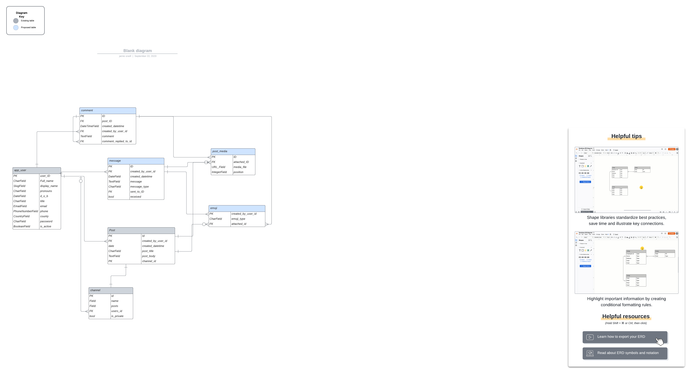 

  
Final Schema

    <h4>Group chat app</h4>
     
    <h4>Messaging</h4>
     
    <h4>User Profile</h4>
     

 

### Surface

#### Colour Scheme
* The primary colour scheme was used for body, headers and nav elements  

 

* The secondary colour scheme was used for buttons, warnings, errors or for highlighting important information. 

#### Fonts
* The fonts I used for this site were imported from [Google Fonts](https://fonts.google.com/): 
**H tags:** *EB Garamond, serif* 
**body:** *Roboto, serif* 

#### Visual Effects
* **Box shadows**  
Multiple box shadows were used for the cover, buttons and images.  
* **Animation** 
Some animations were used for creating a dynamic and attractive design

  
Displaying notifications

 

  
Search bar

 

## Agile Methodology
This project was developed using the Agile methodology. 
All epics and user stories implementation progress was registered using [Github issues](https://github.com/jamie33o/pp4/issues). As the user stories were accomplished, they were moved in the Kanban Board from **Epic**,**User stories**, **To Do**, to **In-progress**, **Testing** and **Done** lists. 

[Sprints can be viewed here](https://github.com/jamie33o/pp4/milestones)

Sprints Details

 
* **Sprint 1 - Epic #1** 
  - Epic: #1 Create login and register page 
  - complete the user stories for this epic  
* **Sprint 2 - Epic #2** 
  - Epic #2: Create a direct messaging page 
  - complete the user stories for this epic 
* **Sprint 3 - Epic #3** 
  - Epic #3: Create a Profile page 
  - complete the user stories for this epic 
* **Sprint 4 - Epic #4** 
  - Epic #4: Create a Group chat homepage 
  - complete the user stories for this epic 

  

## Features
### Existing Features

#### Account pages
Our website leverages the Django Allauth package for streamlined user authentication and registration. With Allauth, users can easily register using email confirmation. The package provides a secure and customizable solution, offering features such as password reset, email verification, and user-friendly account management views. We chose Allauth for its flexibility, robustness, and the ability to tailor the authentication process to our site's unique needs, ensuring a seamless and secure experience for our users.
  - Sign in page  
    
  - Sign up page  
    
  - Sign out page  
    
  - Email settings page  
  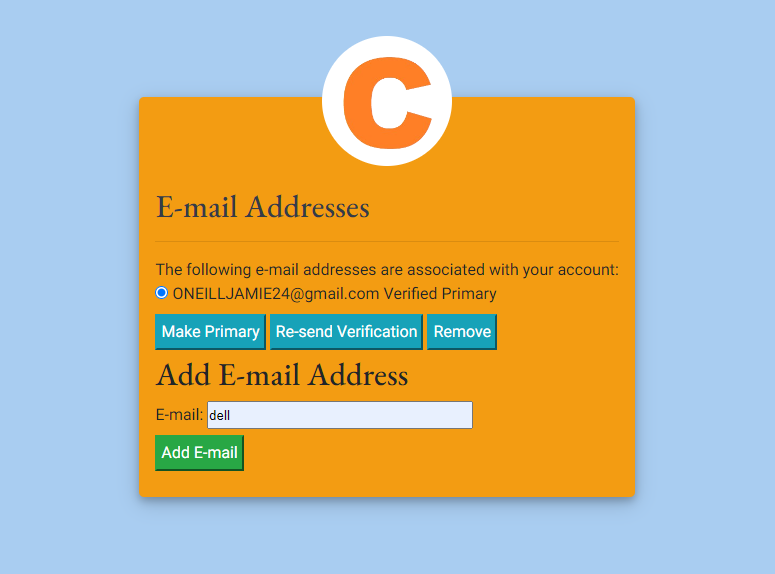  
  - Change Password page  
  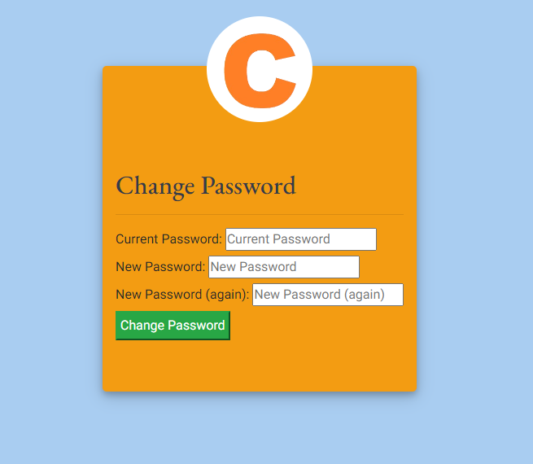  

#### Group chat/Homepage
* On the group chat homepage the page is divided into three sections. 
  1. The channels/New messages list   
     - The channels can be added by staff members and will appear in this list, it shows a count of the amount of members of the specific channel
     - The New messages list is populated when the user has unread messages   
    
  2. The posts for the channel the user has chosen to view   
  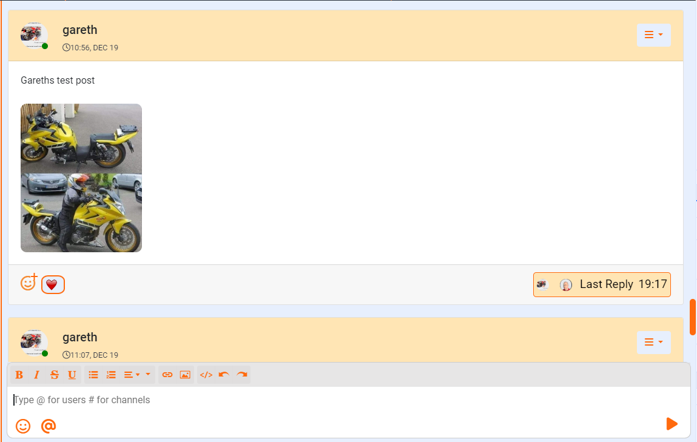   
  3. comments on a specific post, the comments section only shows when the user clicks the comments link on any given post and the post the user clicks is brought into the comment section and comments can then be posted underneath it  
  - Comments visible  
  
  - Comments hidden  
  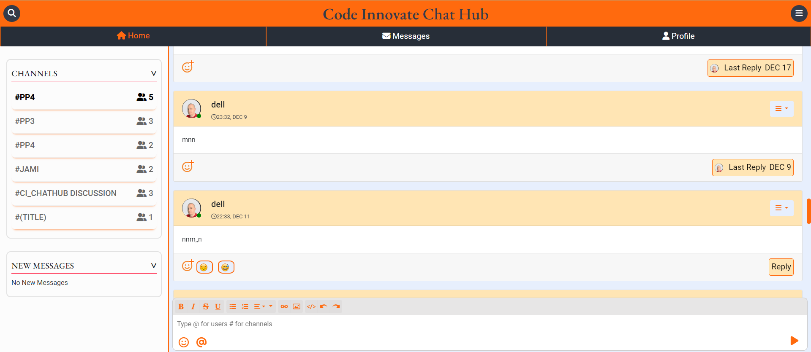  
 
  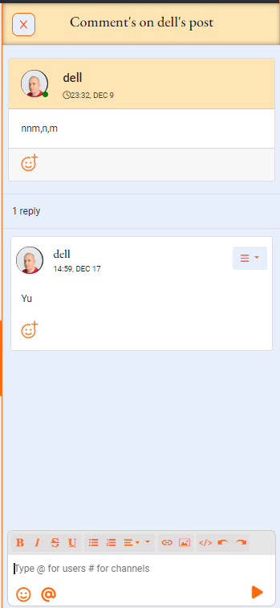  

* Both the posts section and the comments section have an editor, Summer-note editor was used for this it was enhanced to also have emoji's and tagging functionality.

#### Custom Error pages

- 403 error page  
    
- 404 error page  
    
- 500 error page  
    

#### Messaging 
* On the *Messages* page, users have an inbox displaying a comprehensive list of all their conversations with other users. Clicking a conversation link loads the messages list and editor using AJAX. The inbox is equipped with a search bar for users to easily navigate through their conversations.
  
  

#### Profile Page
The Profile page is divided into three sections:
  
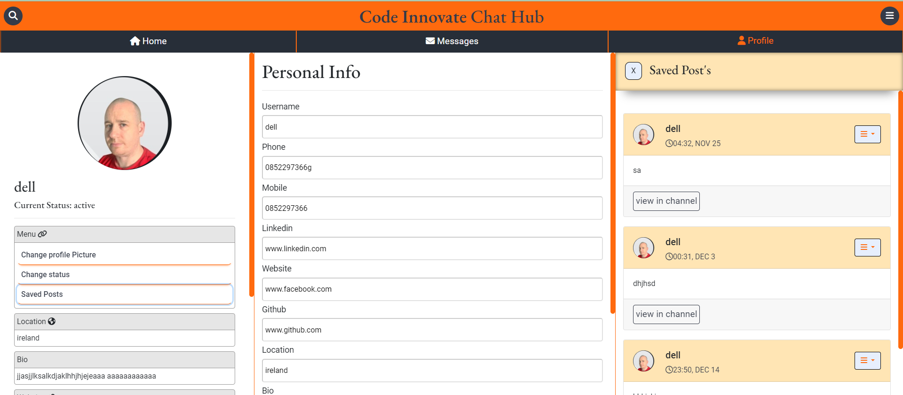  

 1. *Profile view* section 
  - The Profile view section represents how other users perceive one's profile. The menu is only visible to the current user and can be accessed by clicking their profile picture on posts, comments, or messages. 
   
- This is the profile view the user can see if they click the profile tab  
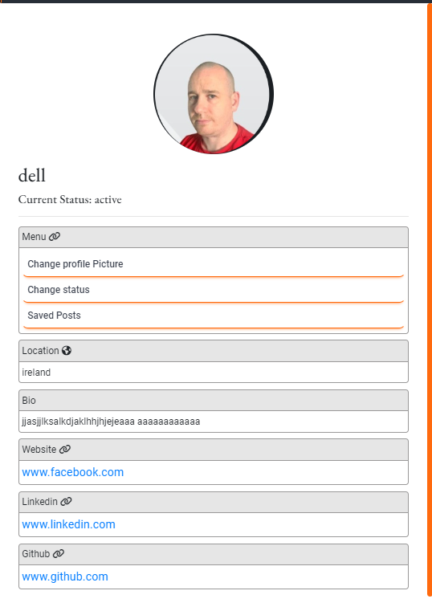  
- This is the view when a user clicks another user's profile picture  
  

- The menu in the profile view has 3 links the first is for the user to change there profile picture when clicked a modal shows up where the user can change there profile image   
  

- The second link is for the user to update there status when clicked it a modal shows up where the user can change there status   
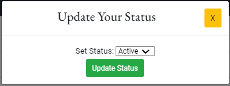  

2. The *Edit profile* section here the user can add there bio, website and social links    
  

3. The third link is for displaying the list of saved posts   
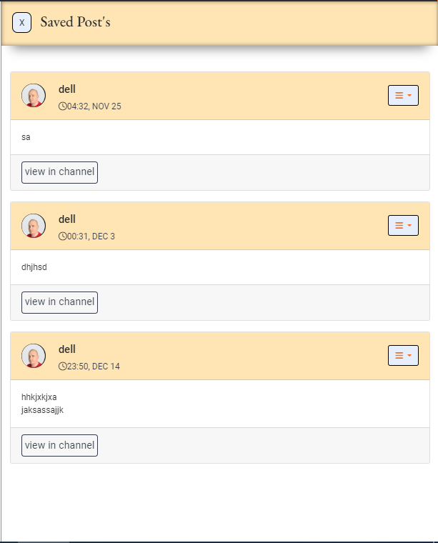  

#### Header Navigation section
The Header section contains the settings icon, website name and the search bar 
  
  
 
- Settings menu  
  
- Search bar list  
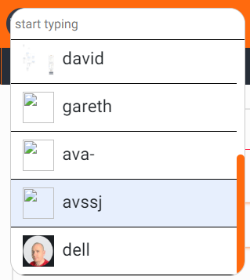  

### Future Feature Considerations

* One possible feature would be the implementation of a *Points system* with badges. Every time a user helps another user by answering a question or helping with a bug, they get points and when they get a certain amount of points they get a badge.

* Another feature would be video calls

## Responsive Layout and Design
The project design has been adapted to all types of devices using Bootstrap predefined breakpoints. For intermediate devices where the design didn't fit accordingly, custom breakpoints were used.

**Breakpoints:**
    - max-width:575.98px
    - max-width:991.98px
    - max-width:1300.98px

**Tested devices:**

    - Moto G4 
    - iPhone SE 
    - iPhone XR 
    - iPhone 11 
    - iPhone 13
    - iPhone 5/SE 
    - iPhone 6/7/8 
    - Ipad
    - Ipad Air 
    - Ipad Mini
    - Ipad Pro 
    - Pixel 5 
    - Surface Duo 
    - Surface Pro 7 
    - Nest Hub 
    - Nest Hub Max
    - Samsung Galaxy S20 Ultra 
    - Samsung Galaxy S8 
    - Galaxy Note 2 
    - Galaxy Tab S4
    - Asus Vivobook

## Tools Used

[GitHub](https://github.com/) - used for hosting the source code of the program 
[Visual Studio](https://code.visualstudio.com/) - for writing and testing the code 
[Heroku](https://dashboard.heroku.com/) - used for deploying the project 
[Balsamiq](https://balsamiq.com/wireframes/) - for creating the wireframes 
[LucidChart](https://www.lucidchart.com/) - used for creating the Flowchart and Database relational schema 
[Favicon.io](https://favicon.io/) - used for generating the website favicon 
[Font Awesome](https://fontawesome.com/) - for creating atractive UX with icons 
[Bootstrap5](https://getbootstrap.com/) - for adding predifined styled elements and creating responsiveness 
[Google Fonts](https://fonts.google.com/) - for typography 
[JsHint](https://jshint.com/) - used for validating the javascript code 
[PEP8 Validator](http://pep8online.com/) - used for validating the python code 
[HTML - W3C HTML Validator](https://validator.w3.org/#validate_by_uri+with_options) - used for validating the HTML 
[CSS - Jigsaw CSS Validator](https://jigsaw.w3.org/css-validator/#validate_by_uri) - used for validating the CSS 
[Chrome Del Tools](https://developer.chrome.com/docs/devtools/) - for debugging the project 
[W.A.V.E.](https://wave.webaim.org/) - for testing accessibility 
[ElephantSQL](https://www.elephantsql.com/) - for storing static data 
LightHouse - for testing performance 

### Python packages

* django 
* gunicorn 
* dj-database-url
* psycopg2
* pylint-django 
* django-allauth
* django-crispy-forms 
* pylint 
* python-dotenv 
* dateutils 
* autopep8

## Testing
The testing documentation can be found at [TESTING.MD](TESTING.md)

## Deployment

### Deploy on Heroku
 1. Create Pipfile 
 
 In the terminal enter the command ` pip3 freeze > requirements.txt`, and a file with all requirements will be created. 
 
 2. Setting up Heroku

    * Go to the Heroku website (https://www.heroku.com/) 
    * Login to Heroku and choose *Create App* 
    * Click *New* and *Create a new app*
    * Choose a name and select your location
    * Go to the *Resources* tab 
    * From the Resources list select *Heroku Postgres*
    * Navigate to the *Deploy* tab
    * Click on *Connect to Github* and search for your repository
    * Navigate to the *Settings* tab
    * Reveal Config Vars and add your Cloudinary, Database URL (from Heroku-Postgres) and Secret key.    

3. Deployment on Heroku

    * Go to the Deploy tab.
    * Choose the main branch for deploying and enable automatic deployment 
    * Select manual deploy for building the App 
    
### Fork the repository
For creating a copy of the repository on your account and change it without affecting the original project, use<b>Fork</b> directly from GitHub:
- On [My Repository Page](https://(https://github.com/jamie33o/pp4)), press <i>Fork</i> in the top right of the page
- A forked version of my project will appear in your repository  

### Clone the repository
For creating a clone of the repository on your local machine, use<b>Clone</b>:
- On [My Repository Page](https://https://github.com/jamie33o/pp4), click the <i>Code</i> green button, right above the code window
- Chose from <i>HTTPS, SSH and GitClub CLI</i> format and copy (preferably <i>HTTPS</i>)
- In your <i>IDE</i> open <i>Git Bash</i>
- Enter the command <code>git clone</code> followed by the copied URL
- Your clone was created

## Credits

### Code
* The code for implementing the emoji modal was obtained from this [GitHub repository](https://github.com/trinhtam/summernote-emoji) . However, I have customized and refactored it to better align with the specific requirements of my website
* The code for channels app was got [here](https://channels.readthedocs.io/en/latest/)
* The html for the post card and the all auth card was inspired from [here](https://bootsnipp.com/)
* Django pagination was taken and adapted from [here](https://stackoverflow.com/questions/12275926/django-pagination)

## Acknowledgements
- Code Institute for all the material and support offered 
- My mentor Gareth McGirr for great tips and his willingness to help me as much as possible with the problems encountered during the development of the project 
- Slack community for great involvement in helping each other 

