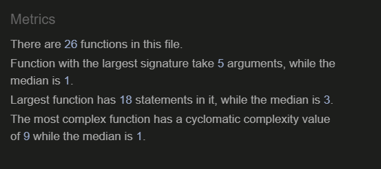
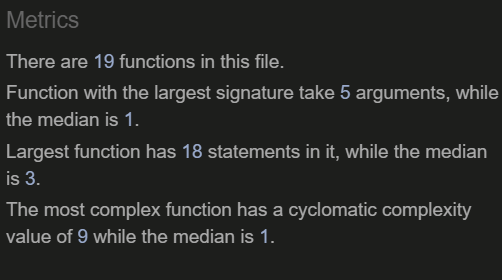
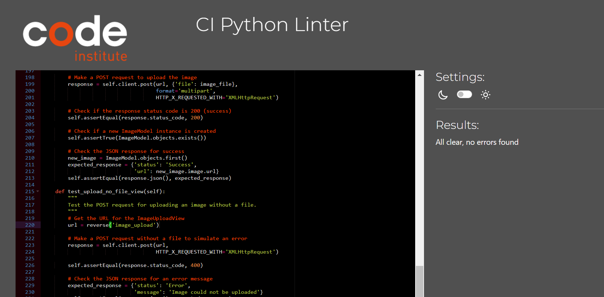
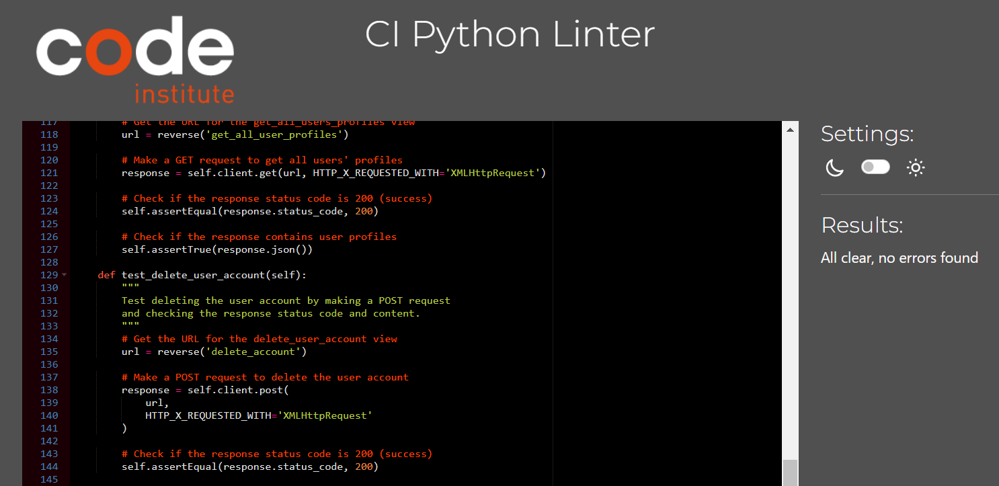
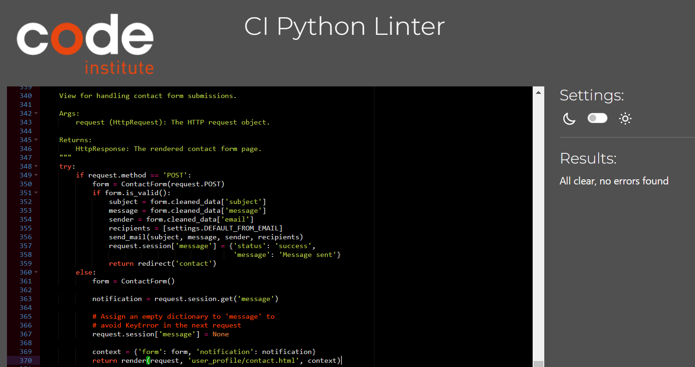
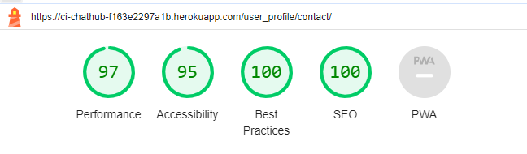

# Testing

Back to [README.MD](README.MD) 

## Table of contents
* [User Story and Feature Testing](#user-story-and-feature-testing)
* [Automated View Testing](#automated-view-testing)
* [Browser Testing](#browser-testing)
* [Code Validation](#code-validation)
* [Bugs](#bugs)

## User Story and Feature Testing
All the user stories were tested manually, that including all the representative features, and were described bellow with a summary of the steps made for demonstrating the validation of the tests:  

### Epic:(Create Login/register page)#1

**User Story #16:** 
As a **User** I can **input my username and password** so that **I can login** 

| **Feature** | **Action** | **Expected Result** | **Actual Result** |
|-------------|------------|---------------------|-------------------|
| Input Username and Password | User provides username and password | Successfully logs in | Works as expected |
  

**User Story #17:** 
As a **User** I can **input my details** so that **I can register**

| **Feature** | **Action** | **Expected Result** | **Actual Result** |
|-------------|------------|---------------------|-------------------|
| Input Details for Registration | User provides necessary details | Successfully registers | Works as expected |
  

**User Story #19:** 
As a **User** I can **Change my email** so that **receive important communications and notifications at my preferred and current email**

| **Feature** | **Action** | **Expected Result** | **Actual Result** |
|-------------|------------|---------------------|-------------------|
| Change Email | User updates email in settings | Email is successfully changed | Works as expected |
  

**User Story #18:** 
As a **User** I want **to have an option to change my password** so that **I can keep my account secure**

| **Feature** | **Action** | **Expected Result** | **Actual Result** |
|-------------|------------|---------------------|-------------------|
| Change Password | User updates password in settings | Password is successfully changed | Works as expected |
  

### Epic:(Direct Messaging)#2

**User Story #20:** 
As a **registered user**, I want to send a direct message to another **user** so that I can **engage in private conversations**.

| **Feature** | **Action** | **Expected Result** | **Actual Result** |
|-------------|------------|---------------------|-------------------|
| Send Direct Message | User selects a user and sends a message | Message is sent privately to the selected user | Works as expected |
  

**User Story #21:** 
As a **registered user**, I want to see a list of my conversations with other **users** so that I can **quickly access and manage my messages**.

| **Feature** | **Action** | **Expected Result** | **Actual Result** |
|-------------|------------|---------------------|-------------------|
| View Conversations List | User navigates to conversations section | List of conversations is displayed for easy access | Works as expected |
  

**User Story #22:** 
As a **registered user**, I want to delete a **conversation** to declutter my messaging interface and **maintain an organized inbox**.

| **Feature** | **Action** | **Expected Result** | **Actual Result** |
|-------------|------------|---------------------|-------------------|
| Delete Conversation | User selects a conversation and deletes it | Conversation is removed from the inbox | Works as expected |
  

**User Story #23:** 
As a **registered user**, I want to receive notifications for new messages in real-time so that I can **stay updated on incoming messages**.

| **Feature** | **Action** | **Expected Result** | **Actual Result** |
|-------------|------------|---------------------|-------------------|
| Real-time Notifications | User receives notifications for new messages | Notifications appear in real-time | Works as expected |
  

**User Story #24:** 
As a **registered user**, I want to have a user-friendly interface for composing and reading messages so that I can **easily navigate and interact with the messaging feature**.

| **Feature** | **Action** | **Expected Result** | **Actual Result** |
|-------------|------------|---------------------|-------------------|
| User-friendly Messaging Interface | User composes and reads messages in a user-friendly interface | Interface is intuitive and easy to navigate | Works as expected |
  

**User Story #25:** 
As a **registered user**, I want to include **images** in my messages to **share media content and enhance communication**.

| **Feature** | **Action** | **Expected Result** | **Actual Result** |
|-------------|------------|---------------------|-------------------|
| Send Images in Messages | User attaches images to messages | Images are successfully sent and displayed in messages | Works as expected |
  

**User Story #26:** 
As a **registered user**, I want to use **emojis** in my messages to **express emotions and add a personal touch to my communication**.

| **Feature** | **Action** | **Expected Result** | **Actual Result** |
|-------------|------------|---------------------|-------------------|
| Use Emojis in Messages | User inserts emojis in messages | Emojis are displayed and convey emotions in messages | Works as expected |
  

**User Story #27:** 
As a **registered user**, I want to search through my messages to find specific content or conversations so that I can **quickly locate relevant information**.

| **Feature** | **Action** | **Expected Result** | **Actual Result** |
|-------------|------------|---------------------|-------------------|
| Search Messages | User uses search functionality to find specific content | Relevant messages or conversations are displayed in search results | Works as expected |
  

### Epic:(Profile page)#3 
**User Story #28:** 
As a **registered user**, I want to create a profile so that I can **provide information about myself**.

| **Feature** | **Action** | **Expected Result** | **Actual Result** |
|-------------|------------|---------------------|-------------------|
| Create Profile | User navigates to profile creation section | Profile is created with user-provided information | Works as expected |
  

**User Story #29:** 
As a **registered user**, I want to upload a profile picture so that I can **personalize my profile**.

| **Feature** | **Action** | **Expected Result** | **Actual Result** |
|-------------|------------|---------------------|-------------------|
| Upload Profile Picture | User selects a profile picture and uploads it | Profile picture is displayed on the user's profile | Works as expected |
  

**User Story #30:** 
As a **registered user**, I want to edit my profile information so that I can **keep it up-to-date**.

| **Feature** | **Action** | **Expected Result** | **Actual Result** |
|-------------|------------|---------------------|-------------------|
| Edit Profile Information | User navigates to the profile edit section | Profile information is updated with new details | Works as expected |
  

**User Story #31:** 
As a **registered user**, I want to customize my status settings on my profile so that I can **control who knows I'm online**.

| **Feature** | **Action** | **Expected Result** | **Actual Result** |
|-------------|------------|---------------------|-------------------|
| Customize Status Settings | User goes to profile settings | User can control who sees their online status | Works as expected |
  

**User Story #32:** 
As a **registered user**, I want to link to my social media accounts in my profile so that I can **share additional online presence**.

| **Feature** | **Action** | **Expected Result** | **Actual Result** |
|-------------|------------|---------------------|-------------------|
| Link Social Media Accounts | User adds links to social media accounts | Links are displayed on the user's profile | Works as expected |
  

**User Story #33:** 
As a **registered user**, I want to showcase my achievements or skills on my profile so that I can **highlight my accomplishments**.

| **Feature** | **Action** | **Expected Result** | **Actual Result** |
|-------------|------------|---------------------|-------------------|
| Showcase Achievements | User adds achievements or skills to their profile | Achievements or skills are displayed on the user's profile | Works as expected |
  

**User Story #34:** 
As a **registered user**, I want to receive notifications when someone views or interacts with my profile so that I can **stay informed about profile engagement**.

| **Feature** | **Action** | **Expected Result** | **Actual Result** |
|-------------|------------|---------------------|-------------------|
| Receive Profile Notifications | User enables profile engagement notifications | User receives notifications for profile views or interactions | Works as expected |
  

**User Story #35:** 
As a **registered user**, I want to delete my profile so that I can **remove my information from the platform**.

| **Feature** | **Action** | **Expected Result** | **Actual Result** |
|-------------|------------|---------------------|-------------------|
| Delete Profile | User goes to account settings and deletes profile | User's profile and information are removed from the platform | Works as expected |
  

### Epic:(Group chat homepage)#4

**User Story #5:** 
As a **staff member**, I want to create a group channel so that I can **initiate group conversations**.

| **Feature** | **Action** | **Expected Result** | **Actual Result** |
|-------------|------------|---------------------|-------------------|
| Create Group Channel | Staff member clicks on "Create Channel" | Group channel is successfully created | Works as expected |
  

**User Story #6:** 
As a **registered user**, I want to see a list of group channels so that I can **easily navigate between different discussions**.

| **Feature** | **Action** | **Expected Result** | **Actual Result** |
|-------------|------------|---------------------|-------------------|
| View Group Channels | User navigates to "Group Channels" | List of group channels is displayed | Works as expected |
  

**User Story #7:** 
As a **registered user**, I want to join a group channel so that I can **participate in specific discussions**.

| **Feature** | **Action** | **Expected Result** | **Actual Result** |
|-------------|------------|---------------------|-------------------|
| Join Group Channel | User clicks on "Join Channel" | User successfully joins the selected group channel | Works as expected |
  

**User Story 4:** 
As a **registered user**, I want to leave a group channel so that I can **manage my group memberships**.

| **Feature** | **Action** | **Expected Result** | **Actual Result** |
|-------------|------------|---------------------|-------------------|
| Leave Group Channel | User clicks on "Leave Channel" | User successfully leaves the selected group channel | Works as expected |
  

**User Story #8:** 
As a **registered user**, I want to send messages in a group channel so that I can **communicate with other members**.

| **Feature** | **Action** | **Expected Result** | **Actual Result** |
|-------------|------------|---------------------|-------------------|
| Send Message in Group Channel | User types message and clicks "Send" | Message is posted in the group channel | Works as expected |
  

**User Story #9:** 
As a **registered user**, I want to receive notifications for new messages in group channels so that I can **stay updated on group conversations**.

| **Feature** | **Action** | **Expected Result** | **Actual Result** |
|-------------|------------|---------------------|-------------------|
| Receive Message Notifications | User receives a notification for new messages | Notifications appear when new messages are posted | Works as expected |
  

**User Story #10:** 
As a **registered user**, I want to see a list of unread messages in each group channel so that I can **quickly catch up on new content**.

| **Feature** | **Action** | **Expected Result** | **Actual Result** |
|-------------|------------|---------------------|-------------------|
| View Unread Messages | User navigates to "Unread Messages" | List of unread messages in each group channel is displayed | Works as expected |
  

**User Story #11:** 
As a **registered user**, I want to create posts in a group channel so that I can **share information or initiate discussions**.

| **Feature** | **Action** | **Expected Result** | **Actual Result** |
|-------------|------------|---------------------|-------------------|
| Create Post in Group Channel | User clicks on "Create Post" | Post is successfully created in the group channel | Works as expected |
  

**User Story #12:** 
As a **registered user**, I want to comment on posts in a group channel so that I can **engage in conversation about specific topics**.

| **Feature** | **Action** | **Expected Result** | **Actual Result** |
|-------------|------------|---------------------|-------------------|
| Comment on Post in Group Channel | User adds a comment and clicks "Submit" | Comment is successfully posted on the selected post | Works as expected |
  

**User Story #13:** 
As a **registered user**, I want to edit my posts or comments in a group channel so that I can **correct or update my contributions**.

| **Feature** | **Action** | **Expected Result** | **Actual Result** |
|-------------|------------|---------------------|-------------------|
| Edit Post or Comment | User clicks on "Edit" for a post or comment | Post or comment is successfully edited | Works as expected |
  

**User Story #14:** 
As a **registered user**, I want to delete my posts or comments in a group channel so that I can **manage the content I've shared**.

| **Feature** | **Action** | **Expected Result** | **Actual Result** |
|-------------|------------|---------------------|-------------------|
| Delete Post or Comment | User clicks on "Delete" for a post or comment | Post or comment is successfully deleted | Works as expected |
  

**User Story #15:** 
As a **registered user**, I want to use emojis in messages, posts, and comments so that I can **express emotions and add a personal touch**.

| **Feature** | **Action** | **Expected Result** | **Actual Result** |
|-------------|------------|---------------------|-------------------|
| Use Emojis in Messages, Posts, and Comments | User selects emoji and adds it to the text | Emojis are displayed in the messages, posts, and comments | Works as expected |
  

### Additional Manual Testing
#### Error Handling

* Ensure that **403 HTTP** errors display custom 403.html.
    - **Stress Test:** Input a route in the URL for accessing another user content
* Ensure that **404 HTTP** errors display the custom 404.html.
    - **Stress Test:** Input a random route in the URL that can't be found in the declared paths of the project
* Ensure that **500 HTTP** errors display the custom 500.html.
    - **Stress Test:** Set debug to false and try to access a path that has been broken intentionally.

#### Interface Interaction

* Ensure all interactive elements respond appropriately:
    - **Desktop:**
        - All navbar elements correctly respond to hovering.
        - All buttons correctly respond to hovering.
        - All authentication links correctly respond to hovering
    - **Mobile:**
        - All navbar elements correctly respond to touch.
        - All buttons correctly respond to touch.
        - All authentication links correctly respond to touch

#### Links

* Ensure the external links to social media present in the profile view open up in new tabs.

## Automated View Testing
### Test Overview
- I used the local db.sqlite3 database when testing
* **Group Chat/Homepage App** 
Tests applied for Epic: **#4** 
  

* **Messaging App** 
Tests applied for Epic: **#2** 
  

* **User Profile App** 
Tests applied for Epic: **#3** 
  

## Browser Testing
The website was tested on different browser for assuring the features work accordingly.
* Chrome
* Edge
* Safary
* Opera
* Firefox

## Code Validation
### HTML

The html code of the website was validated using [W3 Markup Validator](https://validator.w3.org/). 
At the time of deployment the validation for all pages have the following outcome:  

  

The following pages have been tested:
* Home/Group chat
* Messaging
* Profile
* Contact us
* Email settings
* Change Password
* Login/Register
* 403/404/405/500 custom page

### CSS

The CSS code was validated using [W3 Jigsaw Validator](https://jigsaw.w3.org/css-validator/) 
At the time of deployment the validation for All CSS files, have the following outcome:  

  

### Javascript

The Javascript code was validated using using [JsHint](https://jshint.com/) 

Group Chat/Home Page app Javascript validation

* **tests.py** 
  

Messaging app Javascript validation

* **me.py** 
  

User profile Javascript validation

* **user-profile.js** 
  

### Python
The python code was tested using [PEP8](http://pep8online.com/) online validator. 

**Pep8 results:** 

Group Chat/Home Page app

* **tests.py** 
  

* **urls.py** 
  

* **views/posts_commets.py** 
  

* **views/channels.py** 
  

* **views/utils.py** 
  

Messaging app

* **apps.py** 
  

* **consumers.py** 
  

* **forms.py** 
  

* **models.py** 
  

* **tests.py** 
  

* **urls.py** 
  

* **views.py** 
  

Profile app

* **signals.py** 
  

* **forms.py** 
  

* **models.py** 
  

* **tests.py** 
  

* **urls.py** 
  

* **views.py** 
  

### Accessibility 
The Accessibility of the website was tested with the google plugin: [Accessibility Insights for Web](https://accessibilityinsights.io/docs/web/overview/)

**Results for all pages:** 
  

### Performance
The performance of the website was tested with [Google Lighthouse](https://developer.chrome.com/docs/lighthouse/overview/)

**Lighthouse reports:** 

Desktop

* Home page 
  

* Messaging page 
  

* Profile page 
  

* Contact page 
  

* Change password page 
  

* email settings page 
  

* Logout page 
  

* Login page 
  

* Register page 
  

Mobile
  

* Home page 
  

* Messaging page 
  

* Profile page 
  

* Contact page 
  

* Change password page 
  

* email settings page 
  

* Logout page 
  

* Login page 
  

* Register page 
  

 

## Bugs 

### Unfixed bugs

* **All known bugs have been fixed**

### Fixed bugs

| **Bug** | **Fix** |
| --- | --- |
| Bug: Performance is very low | Solution: Load Css and Javascript asynchronously |
| Bug: issue where profile picture doesn't contain a file | Solution: [move the dictionary in broadcast function to context variable and only add profile picture if it exist in if statement](https://github.com/jamie33o/pp4/commit/fc70dd5261ac0d6bf112f25e91402261f4713d42)|
| Bug: global consumer notification for comments throws exception | Solution: [get_commented_users function was returning list of dictionaries updated to return a list of user ids](https://github.com/jamie33o/pp4/commit/1cd988ff5d54ff3d593e420248117e2419948c59) |
| Bug: Inbox search functionality search on every input | Solution: [Add if statement to check that the input is @ symbol](https://github.com/jamie33o/pp4/commit/7fcaa8d53fe5cd596c572457f20693131411296b) |
| Bug: Issue with tagging functionality When user clicked a user name in the tags list the text with the @ symbol removed was missing part of the text | Solution: [I used a for each loop to add all html elements in the atremoved variable ](https://github.com/jamie33o/pp4/commit/948f5663e751b9787c1568a8bd8f154341daebc6) |
| Bug: wrong url name in header links | Solution: [ add the correct url ](https://github.com/jamie33o/pp4/commit/45aa512957ae9986f12116b6dd5d2fe0085f6fd4) |

Back to [README.MD](README.MD) 